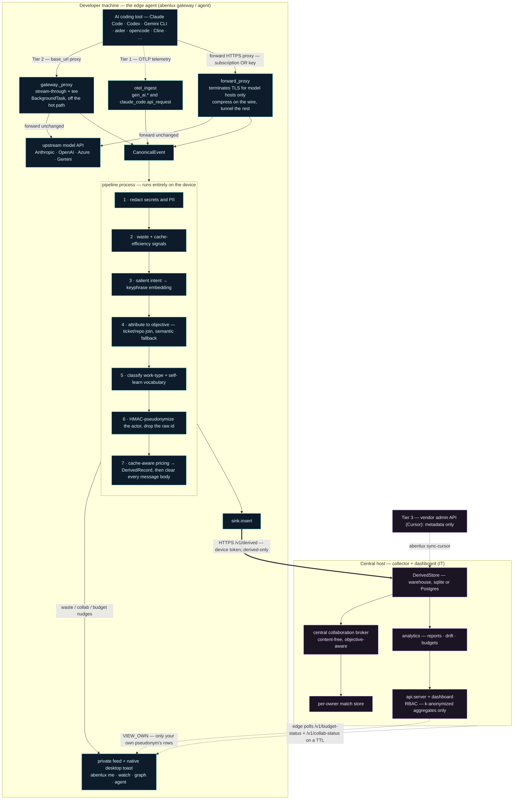

# Architecture

Abenlux has two runtimes that share one domain core. The core (`schema`, `pipeline`, `processing`,
`attribution`, `salience`, `privacy`, `pricing`, `analytics`, `collaborate`) depends only on the
standard library, so it is trivially testable; the web and ML concerns live at the edges (`capture`,
`api`, `embedding`, `agent`).

The whole privacy posture is the **order of operations on the device**: a prompt is redacted, derived
into vectors and counts, attributed, and pseudonymized *before* anything is written or leaves the
machine. Only a content-free `DerivedRecord` ever crosses to the central host.

## Data flow

The dashed line back to the feed is the point of the product: a developer's own data and nudges stay
on their machine; the only thing that travels *to* the edge from the host is a content-free budget and
collaboration status poll that drives a private toast.

## Capture is tiered by how each tool makes its call

| Tier | Mechanism | Tools | What it sees |
|---|---|---|---|
| **1 — OTLP native** | the tool self-instruments to an OTLP endpoint | Claude Code, Codex, Gemini CLI | usage + cache tokens; content only if the tool exports it |
| **2 — gateway proxy** | the tool honors a custom `base_url` → loopback reverse proxy | aider, Cline, Continue, opencode, Crush, Droid, Goose, … | full request/response (redacted on-device) |
| **3 — vendor admin** | a server-side tool exposes an admin/usage API | Cursor, Copilot | metadata only (no prompt) |

`capture/otel_ingest.py` parses **two** Tier-1 shapes: the `gen_ai.*` semantic conventions, and Claude
Code's own `claude_code.api_request` **log** events (bare `input_tokens`/`cache_read_tokens`
attributes, not `gen_ai.*` — so it needs its own parser; its raw `user.email` is dropped at parse
time, the hashed `user.id` is the actor). `capture/adapters.py` handles every Tier-2 wire format:
Anthropic `/v1/messages`, OpenAI `/v1/chat/completions`, the OpenAI **Responses API** `/v1/responses`
(Codex), Azure OpenAI `/openai/deployments/.../chat/completions`, and Gemini
`/v1beta/models/...` — including Gemini's URL-based streaming flag (`:streamGenerateContent`, no body
field) and its model living in the URL, both of which are easy to mis-handle and were caught by driving
the real CLIs.

## The five privacy invariants (and where each is enforced)

1. **Redaction precedes persistence and derivation.** `pipeline.process` runs `redact_event_inplace`
   as step 1, before embedding, attribution, or any write. After the `DerivedRecord` is built, every
   message body is set to `""`. Proven on disk by `test_integration` and `test_real_sdk` (a real
   Anthropic SDK call with a secret in the prompt → the secret is absent from the store file), and on
   real Tier-1 data by `test_claude_code_otel` (the raw `user.email` never reaches the record).

2. **Only derived data leaves the device.** The `DerivedSink` either writes locally (solo) or POSTs a
   `DerivedRecord.to_dict()` to the collector. The collector's `/v1/derived` accepts **only known
   derived fields** — a smuggled `messages`/`content` key is dropped at the schema boundary
   (`test_forwarding`).

3. **Identity is one-way.** `strip_raw_actor_inplace` replaces the raw actor with an HMAC pseudonym
   and drops the raw id in-flight. The same key on edge and collector makes a person's rows line up for
   their *own* view without ever storing a name. The key lives in a secret store the analytics plane
   cannot read; the gateway refuses to run management rollups on the default dev key.

4. **Management sees only k-anonymized aggregates.** `analytics.reports` gates every group through
   `KAnonymityGate` (default k≥5; sub-k groups are suppressed, not noisily shown) and DP-noises
   org-wide totals. There is **no permission** for individual drilldown — see invariant 5.

5. **No role can see another individual.** `auth/rbac.py` defines `VIEW_OWN`, `VIEW_AGGREGATES`,
   `VIEW_COST`, `MANAGE`. `VIEW_OWN` is scoped to the caller's own pseudonym; there is deliberately no
   permission granting per-person detail to anyone. Enforced server-side in `api/server.py` and
   verified by `test_rbac` + `test_api` (developer → 403 on `/api/report`; `/api/me` returns only the
   caller's rows).

## Two ways to put the agent in front of a tool

There are two shapes the edge agent can take, and they cover every way a tool signs in.

The first is a **reverse proxy**. The tool points its base url at the agent, the agent forwards to the
real provider, and it rewrites the outbound request on the way for compression. This needs the tool to
accept a base url, which a tool driven by an API key does, but a tool signed in with a subscription does
not, because a subscription cannot be redirected like that.

The second is a **forward TLS-terminating proxy** in `capture/forward_proxy.py`. The tool routes through
the agent as an ordinary HTTPS proxy. The agent owns a tiny local certificate authority (`LocalCA`) that
mints a short-lived leaf certificate per model API host on demand, so it can present a trusted
certificate, decrypt the request, run the SAME compression and the SAME capture pipeline the reverse
proxy uses (`compress_request` then `gateway._capture`), and forward to the real provider with the
tool's own credential untouched. Two rules bound it. It only terminates TLS for the known model API
hosts and tunnels every other host straight through unread, and the launcher `abenlux run <tool>` sets
the proxy and the trusted certificate for just that one process, so the browser and everything else are
never touched. Because the request is read and rewritten on the wire here, compression, model routing and
the exact match cache all work for a subscription tool and a key tool alike, which is why a separate
tool-output compressor at the agent's hook layer is no longer required, and why a developer signed in
with a subscription gets the same savings as one bringing a key. The forward proxy is exercised against
the real provider in `examples/proxy-e2e`,
and `examples/proxy-suite-e2e` drives **both** capture paths side by side in one run, the base-url
gateway and the forward proxy, six developers and tools across all three providers with real keys,
asserting **17 checks** including the traffic-isolation proof (a non-model host validates against the
system trust store so it was tunnelled untouched, and a model host fails it so it was intercepted) and
writing a detailed `REPORT.md`.

## The collector is the authoritative trust boundary

The edge runs on the developer's machine, so a buggy or hostile one could forge a record. The collector
therefore treats the edge as semi-trusted and re-derives or validates every authoritative fact on
`/v1/derived` rather than believing the wire:

- **Cost is re-priced from clamped token facts**, never the caller's `cost_usd`. Token counts are
  clamped to a non-negative bound, and a local-cache hit carries **zero billable tokens** (the avoided
  input rides on `saved_input_tokens`), so it prices to $0 without a trusted flag - a `served_from_cache`
  flag can no longer zero a real call's cost.
- **Identity is bound to a known principal.** When a principals registry is configured, a record naming
  an unknown `actor_pseudonym` is rejected (no fabricated-actor k-anonymity dilution or feed poisoning),
  and `tenant_id` is stamped from the authenticated principal so a forged tenant cannot move spend.
- **The org and residency walls come from the tenant registry**, not the edge-supplied values, and the
  request body is size-bounded before parsing.
- **DP noise is deterministic per query** (HMAC-seeded, keyed per tenant/metric), so repeated benchmark
  or report calls cannot be averaged to cancel the noise and recover a raw figure.

This boundary is exercised adversarially by `examples/attack-e2e`, a Dockerized multi-tenant harness
that seeds real Anthropic, OpenAI and Gemini traffic across two orgs and then attacks auth, RBAC,
tenancy, the privacy boundary, cost integrity, identity binding, k-anonymity, the compression layer,
the exact cache and the collaboration org wall.

## The edge pipeline, step by step

`pipeline.process` is the heart of the system and the privacy boundary. Each numbered step in the
diagram maps to one concern:

- **Salient intent (step 3) is the keystone.** Long, code-heavy, multi-part prompts are reduced to
  their intent-dense core (`salience.py`: strip code/stack-trace noise, keep the highest-salience
  sentences) before both classification and embedding. This is deterministic and free — no ML model,
  no per-call LLM. It is *why* a pasted stack trace doesn't get mislabelled a "fix", and *why*
  collaboration matching is sharp: the vector is built from **keyphrases** (domain terms, stopwords
  dropped), so two developers on the same problem match even when phrased differently.

- **Work-type classification (step 5)** is a cascade: branch convention first (auditable
  ground-truth), then a weighted keyword/pattern classifier over the salient text plus the device's
  self-learned vocabulary, then — only when all of those miss — one tiny, cached, extractively
  compressed LLM call (optional; OpenAI/Azure/Claude/Gemini). Every confident label teaches the free
  keyword layer, so the LLM fires less over time. Accuracy is held by a labelled corpus
  (`test_intent_corpus`): 98.6% on 69 varied prompts, 100% on the net-new-vs-maintenance split.

- **Cache-aware pricing (step 7)** separates fresh input from cache reads and writes per call, so cost
  matches the provider's bill to the cent. It also powers the **cache-inefficiency** nudge (step 2):
  resent context that *isn't* being cached is the one token-saving lever with zero loss of detail —
  the exact same context, billed as a cache hit.

## Collaboration

Matching runs **centrally at the collector** (`api/server._match_centrally`) over the content-free
forwarded records — the embedding + objective label, never prompt text — so two developers on two
machines actually match. The broker (`collaborate/broker.py`) is **objective-aware**: a high topic
overlap within the same objective pairs people (bar 0.40 on the keyphrase-hashing embedder), while a
*different* objective needs a stronger match (0.55), because cross-objective overlap is more often
coincidental. It is **precision-first** — a false pairing is worse than a miss — and verified at 100%
precision on a labelled corpus (`test_collab_corpus`). Two walls are enforced in code: it never matches
across a different **client** (Chinese wall) or a **data-residency** boundary. Identities and contact
handles are revealed only on a **mutual double-blind consent**, and in org mode the edge agent
live-pushes a toast by polling `/v1/collab-status` for its own new matches.

## Multi-tenancy, the Reuse-Yield Ledger, and the Benchmark Exchange

A **tenant** is an org unit or geography of one org (`acme-eu`, `acme-us`). The edge stamps
`tenant_id` on every `DerivedRecord` (from `ABEN_TENANT`, alongside `residency`), so a tenant is a
content-free partition of the warehouse, not a separate database. `store._tenant_pred` builds the
`WHERE tenant_id=?` fragment threaded through every aggregate (`totals`, `rollup`,
`orphan_token_share`, `time_bounds`, `window_stats`, `new_objectives`, `objective_window_cost`) — so
the report, budgets, **and the spend-drift trend** all scope to one tenant. `"default"` also matches
`NULL` so legacy rows belong to the default tenant, and the edge `claim_null_tenant`s its pre-tenant
history when it adopts a named tenant, so nothing is orphaned. The registry (`tenants.py`) maps a
**global** `tenant_id → {org, display_name, residency}` and *refuses to reassign an id across orgs* —
otherwise one org could re-create a rival's `tenant_id`, flip its org, and read its reports through the
org gate. RBAC carries `Principal.tenant_id`/`org`: a principal reports **only its own tenant**, and
`_resolve_report_tenant` lets it pull a sibling tenant **only if that tenant is in its own org** —
cross-tenant *detail* never crosses the org wall. Cross-tenant *comparison* is the benchmark, the only
cross-tenant surface. The collaboration broker carries `org` on every `TopicSignal` too, so two orgs
sharing one collector are never introduced to each other.

**Reuse-Yield Ledger** (`ledger.py`) books money **not** spent. When `_match_centrally` fires a broker
match, `_book_avoided` records one content-free *opportunity* keyed on stable ids only
(`tenant∷pair∷objective∷work_type` — never the display label, so label drift can't re-book), with the
mode upgrade (live-duplication → solved-reuse) applied as an **atomic conditional upsert**. The dollar
value and the k-gate are **recomputed at read time** in `summary(store, …)` from the live derived data:
for each `(objective, work_type)` it takes every developer's total spend (`store.actor_costs_for`) and
computes a **winsorized mean** cost-to-solve (trim the extremes, average the rest) × a mode factor
(full for solved-reuse, half for live-duplication). Read-time recompute makes the figure deterministic
(no ingest-order dependence) and self-healing (an opportunity booked below k is credited automatically
once enough developers solve that work); the winsorized mean is robust to a runaway session **and** is
never any single developer's exact spend. It is **k-anonymity gated** (credited only when ≥k developers
back the cost-to-solve) and surfaced **beside** spend (`/api/savings`, `reuse_yield` on `/api/report`),
never summed into it.

**Cross-tenant Benchmark Exchange** (`analytics/benchmark.py`) compares tenants of one org on **ratios
only** — `cost_per_1k_tokens`, `cache_hit_ratio`, `orphan_share`, `net_new_share`, `reuse_share`, … —
so no absolute size leaks. The walls: a tenant joins the cohort only if it clears **k-anonymity**
(≥k developers); the comparison is released only above a **cohort threshold** (`k_tenants`, default 3);
an **unpriced** tenant (cost 0, model not in the price table) is excluded from cost-denominated metrics
so it can't collapse the cohort minimum; and cohort **order statistics are withheld for small cohorts**
— `min`/`max` only above 5 tenants, the `median` only above 4 — because for three tenants the
min/median/max *are* the three tenants' near-raw ratios. A tenant's standing is a **percentile** within
the cohort. All released figures for a metric (your value, min, median, max, and the percentile) are
derived from **one Laplace-noised, sorted series**, so the row is internally consistent (you within
`[min,max]`, `min ≤ median ≤ max`) and DP-perturbed as defense in depth. The cohort is the org's
registered tenants; only the unconfigured `default` org falls back to `distinct_tenants()`, and even
then admits a raw id only if the registry shows it unregistered or owned by the same org, so a named
org's tenants never leak into the default cohort.

## The compression layer

Because the gateway is a loopback proxy that the tool already points its `base_url` at, it is the one
place that can shrink the **outbound request** for *every* tool at once. `compress/__init__.py` is a
registry of `Strategy` objects, each operating on the parsed request body (provider-aware over the
Anthropic / OpenAI / Gemini shapes) and returning a possibly-new body plus the input tokens it removed.
`_proxy` runs the enabled strategies before `client.send`, swaps the body, and records content-free
`saved_input_tokens` + the applied strategy names on the `DerivedRecord`. Two invariants protect the
developer: (1) a strategy that raises is skipped (`compress_request` isolates each one), so compression
can **never break a call**; (2) only strategies that are lossless AND do not rewrite prompt **content**
run by default - today that is `prefix_stabilize`, the automatic **Prefix-Break Localizer**, which only
*reorders* an injected date/id out of the cache-stable prefix so prompt caching hits. Content-rewriting
strategies (`command_trim` RTK-style, `otsl_tables` DocLang-style, `compress_json` Headroom-style,
`slim_tools` Bifrost-style) are opt-in via `ABEN_COMPRESS`, applied to every tool with one flag.

An **exact-match request cache** sits beside it: a byte-identical non-streamed repeat within a TTL is
served from a bounded on-device LRU with no upstream call. The cached response is content and stays on
the device, never forwarded; the served record is stamped `served_from_cache`, costs nothing, and the
collector honors that flag in `_harden_inbound` rather than re-pricing it. The realized savings surface
as a compression-yield block in the management report, beside spend, never inside it.

These are abenlux's own bounded implementations that interoperate with and credit the open tools that
pioneered each lever (RTK, DocLang/Docling, Headroom, Bifrost Code Mode); RTK in particular runs *below*
abenlux at the agent tool-hook layer, so the two stack and `agent install` wires RTK's hook when present.

Two newer savers live in the same registry. `cache_breakpoints` marks the end of the stable system
prompt so Anthropic keeps it in its own cache and reads it back cheaply on later turns, and it skips a
prompt too small to cache. It adds no words the model reads, so it is safe and on by default.
`tool_result_trim` folds the noise out of the tool output that an agent resends every turn. The gateway
also runs the off by default savers quietly in the background without changing the call and writes what
each one would have saved into a content free field, so the report can show what enabling one would save
with evidence. None of this slows the developer's call.

## Model routing

`route.py` decides, on the device and from the request body alone, whether a call is easy enough to send
to a cheaper model. It reads only cheap signals, the work the prompt asks for, the size of the request,
and whether a tool loop is in play, so there is no extra model call. It is conservative by design and
routes down only when the request clearly looks small and low risk, so a real piece of work is never
quietly handled by a weaker model. The gateway and the forward proxy both call it before they forward, so
a base url key tool and a subscription tool are routed the same way. `ABEN_ROUTE=on` rewrites the model
for real, `ABEN_ROUTE=shadow` leaves the call alone and only records what routing would have saved. The
saving is re-derived at the collector in `_harden_inbound` from the two model names and the clamped token
facts, so a buggy or hostile edge can never inflate the routing yield.

## Team memory

`teammemory.py` is a content free index that runs at the collector, where every developer's records meet.
For each new record it looks for a close earlier one from a different teammate in the same tenant, matched
on the embedding only, never the prompt. An almost identical ask in the same language is labelled serve,
the answer could have been reused as is. The same task in another language, told apart by a coarse content
free language tag stamped on the device, is a warm start, a strong head start for a better answer. It
changes no call. It records what a live team memory would have saved, so a manager turns the live version
on with proof. It is scoped to one tenant, so it never crosses the org wall the broker already enforces.

## How a saving reaches the developer

A developer never has to open a dashboard to see a win. A routed call and a cache hit are written to the
private on device feed and raised as a native desktop toast by the background agent, the same path the
waste, collaboration and budget nudges already use. The agent runs as a user level unit in the
developer's own session, a systemd user service on Linux, a launchd LaunchAgent on macOS, and a Startup
folder launcher on Windows, which is the only place the desktop notification daemons live. So whether a
developer works from the terminal or from an IDE with a Claude style plugin, the saving finds them where
they already are.

## What this release adds

A set of new modules sit beside the existing core, each one small and read mostly, and each one keeps
the same rules. Nothing raw leaves the edge, management never sees one individual, and a developer's
call is never put at risk.

- **The value side of the ledger** lives in `analytics/outcomes.py`. A content free feed from git or CI
  posts plain facts about each change to `POST /v1/outcomes`, like did it merge and was it reverted and
  how many lines it touched, keyed by the ticket and resolved to its objective. `analytics/reports.py`
  joins that to spend behind the same k anonymity wall as the dollar total, so the report shows the
  return on spend, like dollars per merged change.
- **Orphan recovery** lives in `analytics/recovery.py`. It groups the unattributed records that carry a
  topic vector and, where a group is shared by at least k developers, proposes a name and the repo it
  came from at `GET /api/orphans`. A manager accepts one and that work tracks itself after that.
- **Solution capsules** live in `developer/capsules.py`. When a clean call cracks a piece of work the
  collector writes a content free card for the solver and the topic, and `/api/me` joins it onto a reuse
  match so the next developer sees which model and tool cracked it without any introduction.
- **The async help relay** lives in `developer/relay.py`. A developer can send a matched peer one
  redacted question right away at `POST /api/collab/{id}/ask`, the peer reads and answers from
  `GET /api/threads` and `POST /api/thread/{id}/reply`, and neither side sees who the other is until they
  both consent. Every message is redacted before it is stored.
- **The negotiation pack** lives in `analytics/negotiation.py` behind `GET /api/negotiation`. It turns
  the spend totals into the blended rate the org pays across every tool, how concentrated the spend is,
  and what a committed use discount would save.
- **The MCP server** lives in `mcp_server.py` behind `abenlux mcp`. It exposes the read views as tools a
  coding agent can call in flow, each one resolving the caller's own token and returning only the
  caller's own data.
- **The cross-org exchange** lives in `analytics/exchange.py`. Each org blurs its own ratios on its own
  machine and posts only the blurred shares to `POST /v1/exchange/submit`. `GET /api/exchange` waits
  until enough orgs have joined and returns the caller's org only its rank in the group, never another
  org's number.

## The background agent

`abenlux agent install` runs the capture agent in the background, started at user login, in the
developer's own GUI session — the only place desktop toasts and the D-Bus/Aqua notification daemons
exist, which is why it is a **user-level** unit, never a root service (`agent/service.py`):

- **Linux** → a systemd `--user` unit
- **macOS** → a launchd LaunchAgent (`RunAtLoad` + `KeepAlive`)
- **Windows** → a hidden Startup-folder launcher (chosen over a scheduled task, which a locked-down
  machine denies a standard user) plus a registered toast AppUserModelID so Win10/11 actually shows it

Config is snapshotted to `~/.abenlux/agent.env` and reloaded by `agent run` before `Settings` reads
the environment. Service-manager calls are best-effort (tolerant of a missing `systemctl`/`launchctl`).

## Why these specific engineering choices

- **Stream-through + BackgroundTask, not buffer-then-return.** A base_url proxy must not add latency or
  break streaming. The gateway tees bytes to the tool as they arrive and runs capture in a Starlette
  `BackgroundTask` *after* the response completes — reliable, unlike an async-generator `finally` under
  ASGI. (A real bug the integration tests caught.)

- **Thread-safe stores.** Capture runs in the BackgroundTask threadpool, so `DerivedStore` /
  `MatchStore` open with `check_same_thread=False` (sqlite is serialized). Postgres is a drop-in
  alternative via `open_store(dsn)`.

- **Snapshot copies in the resent-history tracker.** The pipeline wipes message content after
  derivation; the tracker stores `copy.copy` of each message so the next turn's baseline isn't blanked.
  Conversations are isolated by a key anchored on the first user message, so concurrent sessions don't
  thrash one shared baseline.

- **Authoritative token semantics.** Anthropic's output count is the cumulative value in the final
  `message_delta`, not a sum of deltas; OpenAI usage exists only with `include_usage` (estimated and
  flagged otherwise), and its `prompt_tokens_details.cached_tokens` are split out so the cache discount
  applies; the Responses API uses `input_tokens`/`output_tokens`; Gemini usage is the final
  `usageMetadata`. `capture/adapters.py`.

- **Longest-prefix pricing.** A new point release (`claude-opus-4-8-2026…`) inherits its family price
  instead of falling to $0. Unknown models are flagged `unpriced`, never guessed.

## Testing topology

`make test` runs **350 tests**. They span the pure core unit tests, a FastAPI `TestClient` for RBAC and
the API, subprocess end to end runs of the real Anthropic, OpenAI and Azure OpenAI SDKs through a live
gateway and mock upstream (`test_real_sdk.py`), wire format tests pinned from genuine Claude Code, Gemini
CLI and Codex traffic (`test_tool_capture.py`, `test_claude_code_otel.py`), a full edge to collector
forward loop (`test_forwarding.py`), labelled accuracy corpora for intent and collaboration
(`test_intent_corpus.py`, `test_collab_corpus.py`), the background agent and its per OS units
(`test_agent.py`), model routing and team memory through the real collector (`test_route.py`,
`test_teammemory.py`, `test_routing_teammemory.py`), the subscription developer experience through the
forward proxy (`test_dev_experience.py`), a simulated team exercising suggestions, collaboration walls
and consent, and drift (`test_multiuser.py`, `test_exhaustive.py`), and the multi tenant plane with the
reuse yield ledger and the benchmark exchange (`test_tenants_ledger_benchmark.py`) covering tenant
scoping, k anon savings, DP noised cross tenant percentiles, and the org and residency walls. That
last suite was hardened by a multi-agent adversarial review (independent attackers + skeptic
verification): the org-hijack 409, the read-time-recompute ledger, the winsorized cost-to-solve, the
small-cohort order-stat withholding, and the broker org wall each pin a confirmed finding.

Three reproducible Docker harnesses back the claims that can't live in `make test` (they need Docker):
[`examples/tool-verification`](examples/tool-verification/) drives Gemini CLI, Codex, and opencode
through a running gateway; [`examples/agent-verification`](examples/agent-verification/) verifies the
Linux background agent and a real `notify-send` toast received by a notification daemon; and
[`examples/deep-e2e`](examples/deep-e2e/) stands up the **whole stack** in one container — a mock
upstream, the collector, and one edge gateway per tenant — then drives ~23 developers across 5 tenants
of 2 orgs through multi-turn traffic and asserts **63 checks** spanning every role (developer, manager,
finance, admin), tenant scoping, k-anon suppression, the reuse-yield ledger, the benchmark cohort, the
org wall, double-blind consent, budget overrun, and the auth/ingest-hardening attacks — all on data
produced by real calls, nothing seeded.
