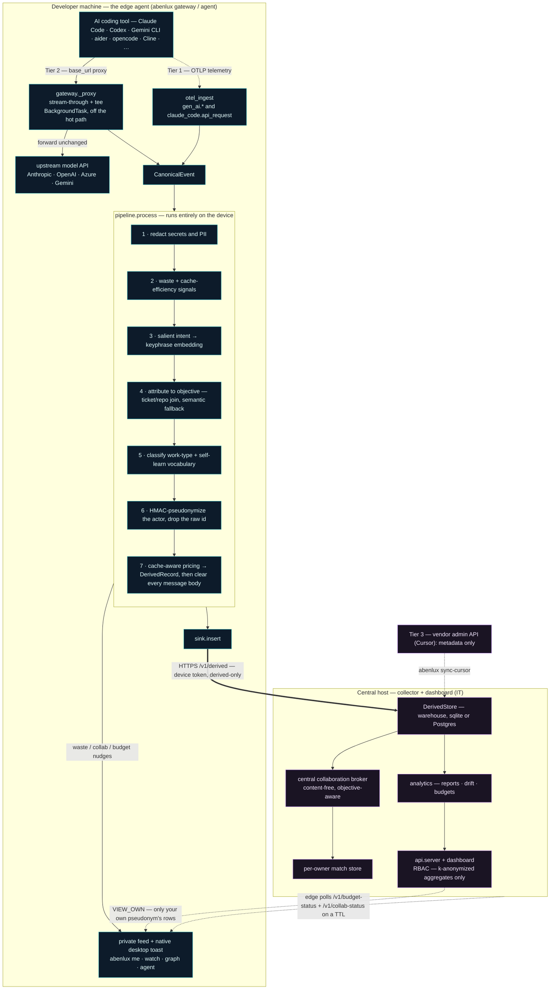

# Architecture

Abenlux has two runtimes that share one domain core. The core (`schema`, `pipeline`, `processing`,
`attribution`, `salience`, `privacy`, `pricing`, `analytics`, `collaborate`) depends only on the
standard library, so it is trivially testable; the web and ML concerns live at the edges (`capture`,
`api`, `embedding`, `agent`).

The whole privacy posture is the **order of operations on the device**: a prompt is redacted, derived
into vectors and counts, attributed, and pseudonymized *before* anything is written or leaves the
machine. Only a content-free `DerivedRecord` ever crosses to the central host.

## Data flow

The dashed line back to the feed is the point of the product: a developer's own data and nudges stay
on their machine; the only thing that travels *to* the edge from the host is a content-free budget and
collaboration status poll that drives a private toast.

## Capture is tiered by how each tool makes its call

| Tier | Mechanism | Tools | What it sees |
|---|---|---|---|
| **1 — OTLP native** | the tool self-instruments to an OTLP endpoint | Claude Code, Codex, Gemini CLI | usage + cache tokens; content only if the tool exports it |
| **2 — gateway proxy** | the tool honors a custom `base_url` → loopback reverse proxy | aider, Cline, Continue, opencode, Crush, Droid, Goose, … | full request/response (redacted on-device) |
| **3 — vendor admin** | a server-side tool exposes an admin/usage API | Cursor, Copilot | metadata only (no prompt) |

`capture/otel_ingest.py` parses **two** Tier-1 shapes: the `gen_ai.*` semantic conventions, and Claude
Code's own `claude_code.api_request` **log** events (bare `input_tokens`/`cache_read_tokens`
attributes, not `gen_ai.*` — so it needs its own parser; its raw `user.email` is dropped at parse
time, the hashed `user.id` is the actor). `capture/adapters.py` handles every Tier-2 wire format:
Anthropic `/v1/messages`, OpenAI `/v1/chat/completions`, the OpenAI **Responses API** `/v1/responses`
(Codex), Azure OpenAI `/openai/deployments/.../chat/completions`, and Gemini
`/v1beta/models/...` — including Gemini's URL-based streaming flag (`:streamGenerateContent`, no body
field) and its model living in the URL, both of which are easy to mis-handle and were caught by driving
the real CLIs.

## The five privacy invariants (and where each is enforced)

1. **Redaction precedes persistence and derivation.** `pipeline.process` runs `redact_event_inplace`
   as step 1, before embedding, attribution, or any write. After the `DerivedRecord` is built, every
   message body is set to `""`. Proven on disk by `test_integration` and `test_real_sdk` (a real
   Anthropic SDK call with a secret in the prompt → the secret is absent from the store file), and on
   real Tier-1 data by `test_claude_code_otel` (the raw `user.email` never reaches the record).

2. **Only derived data leaves the device.** The `DerivedSink` either writes locally (solo) or POSTs a
   `DerivedRecord.to_dict()` to the collector. The collector's `/v1/derived` accepts **only known
   derived fields** — a smuggled `messages`/`content` key is dropped at the schema boundary
   (`test_forwarding`).

3. **Identity is one-way.** `strip_raw_actor_inplace` replaces the raw actor with an HMAC pseudonym
   and drops the raw id in-flight. The same key on edge and collector makes a person's rows line up for
   their *own* view without ever storing a name. The key lives in a secret store the analytics plane
   cannot read; the gateway refuses to run management rollups on the default dev key.

4. **Management sees only k-anonymized aggregates.** `analytics.reports` gates every group through
   `KAnonymityGate` (default k≥5; sub-k groups are suppressed, not noisily shown) and DP-noises
   org-wide totals. There is **no permission** for individual drilldown — see invariant 5.

5. **No role can see another individual.** `auth/rbac.py` defines `VIEW_OWN`, `VIEW_AGGREGATES`,
   `VIEW_COST`, `MANAGE`. `VIEW_OWN` is scoped to the caller's own pseudonym; there is deliberately no
   permission granting per-person detail to anyone. Enforced server-side in `api/server.py` and
   verified by `test_rbac` + `test_api` (developer → 403 on `/api/report`; `/api/me` returns only the
   caller's rows).

## The edge pipeline, step by step

`pipeline.process` is the heart of the system and the privacy boundary. Each numbered step in the
diagram maps to one concern:

- **Salient intent (step 3) is the keystone.** Long, code-heavy, multi-part prompts are reduced to
  their intent-dense core (`salience.py`: strip code/stack-trace noise, keep the highest-salience
  sentences) before both classification and embedding. This is deterministic and free — no ML model,
  no per-call LLM. It is *why* a pasted stack trace doesn't get mislabelled a "fix", and *why*
  collaboration matching is sharp: the vector is built from **keyphrases** (domain terms, stopwords
  dropped), so two developers on the same problem match even when phrased differently.

- **Work-type classification (step 5)** is a cascade: branch convention first (auditable
  ground-truth), then a weighted keyword/pattern classifier over the salient text plus the device's
  self-learned vocabulary, then — only when all of those miss — one tiny, cached, extractively
  compressed LLM call (optional; OpenAI/Azure/Claude/Gemini). Every confident label teaches the free
  keyword layer, so the LLM fires less over time. Accuracy is held by a labelled corpus
  (`test_intent_corpus`): 98.6% on 69 varied prompts, 100% on the net-new-vs-maintenance split.

- **Cache-aware pricing (step 7)** separates fresh input from cache reads and writes per call, so cost
  matches the provider's bill to the cent. It also powers the **cache-inefficiency** nudge (step 2):
  resent context that *isn't* being cached is the one token-saving lever with zero loss of detail —
  the exact same context, billed as a cache hit.

## Collaboration

Matching runs **centrally at the collector** (`api/server._match_centrally`) over the content-free
forwarded records — the embedding + objective label, never prompt text — so two developers on two
machines actually match. The broker (`collaborate/broker.py`) is **objective-aware**: a high topic
overlap within the same objective pairs people (bar 0.40 on the keyphrase-hashing embedder), while a
*different* objective needs a stronger match (0.55), because cross-objective overlap is more often
coincidental. It is **precision-first** — a false pairing is worse than a miss — and verified at 100%
precision on a labelled corpus (`test_collab_corpus`). Two walls are enforced in code: it never matches
across a different **client** (Chinese wall) or a **data-residency** boundary. Identities and contact
handles are revealed only on a **mutual double-blind consent**, and in org mode the edge agent
live-pushes a toast by polling `/v1/collab-status` for its own new matches.

## Multi-tenancy, the Reuse-Yield Ledger, and the Benchmark Exchange

A **tenant** is an org unit or geography of one org (`acme-eu`, `acme-us`). The edge stamps
`tenant_id` on every `DerivedRecord` (from `ABEN_TENANT`, alongside `residency`), so a tenant is a
content-free partition of the warehouse, not a separate database. `store._tenant_pred` builds the
`WHERE tenant_id=?` fragment threaded through every aggregate (`totals`, `rollup`,
`orphan_token_share`, `time_bounds`, `window_stats`, `new_objectives`, `objective_window_cost`) — so
the report, budgets, **and the spend-drift trend** all scope to one tenant. `"default"` also matches
`NULL` so legacy rows belong to the default tenant, and the edge `claim_null_tenant`s its pre-tenant
history when it adopts a named tenant, so nothing is orphaned. The registry (`tenants.py`) maps a
**global** `tenant_id → {org, display_name, residency}` and *refuses to reassign an id across orgs* —
otherwise one org could re-create a rival's `tenant_id`, flip its org, and read its reports through the
org gate. RBAC carries `Principal.tenant_id`/`org`: a principal reports **only its own tenant**, and
`_resolve_report_tenant` lets it pull a sibling tenant **only if that tenant is in its own org** —
cross-tenant *detail* never crosses the org wall. Cross-tenant *comparison* is the benchmark, the only
cross-tenant surface. The collaboration broker carries `org` on every `TopicSignal` too, so two orgs
sharing one collector are never introduced to each other.

**Reuse-Yield Ledger** (`ledger.py`) books money **not** spent. When `_match_centrally` fires a broker
match, `_book_avoided` records one content-free *opportunity* keyed on stable ids only
(`tenant∷pair∷objective∷work_type` — never the display label, so label drift can't re-book), with the
mode upgrade (live-duplication → solved-reuse) applied as an **atomic conditional upsert**. The dollar
value and the k-gate are **recomputed at read time** in `summary(store, …)` from the live derived data:
for each `(objective, work_type)` it takes every developer's total spend (`store.actor_costs_for`) and
computes a **winsorized mean** cost-to-solve (trim the extremes, average the rest) × a mode factor
(full for solved-reuse, half for live-duplication). Read-time recompute makes the figure deterministic
(no ingest-order dependence) and self-healing (an opportunity booked below k is credited automatically
once enough developers solve that work); the winsorized mean is robust to a runaway session **and** is
never any single developer's exact spend. It is **k-anonymity gated** (credited only when ≥k developers
back the cost-to-solve) and surfaced **beside** spend (`/api/savings`, `reuse_yield` on `/api/report`),
never summed into it.

**Cross-tenant Benchmark Exchange** (`analytics/benchmark.py`) compares tenants of one org on **ratios
only** — `cost_per_1k_tokens`, `cache_hit_ratio`, `orphan_share`, `net_new_share`, `reuse_share`, … —
so no absolute size leaks. The walls: a tenant joins the cohort only if it clears **k-anonymity**
(≥k developers); the comparison is released only above a **cohort threshold** (`k_tenants`, default 3);
an **unpriced** tenant (cost 0, model not in the price table) is excluded from cost-denominated metrics
so it can't collapse the cohort minimum; and cohort **order statistics are withheld for small cohorts**
— `min`/`max` only above 5 tenants, the `median` only above 4 — because for three tenants the
min/median/max *are* the three tenants' near-raw ratios. A tenant's standing is a **percentile** within
the cohort. All released figures for a metric (your value, min, median, max, and the percentile) are
derived from **one Laplace-noised, sorted series**, so the row is internally consistent (you within
`[min,max]`, `min ≤ median ≤ max`) and DP-perturbed as defense in depth. The cohort is the org's
registered tenants; only the unconfigured `default` org falls back to `distinct_tenants()`, and even
then admits a raw id only if the registry shows it unregistered or owned by the same org, so a named
org's tenants never leak into the default cohort.

## The background agent

`abenlux agent install` runs the capture agent in the background, started at user login, in the
developer's own GUI session — the only place desktop toasts and the D-Bus/Aqua notification daemons
exist, which is why it is a **user-level** unit, never a root service (`agent/service.py`):

- **Linux** → a systemd `--user` unit
- **macOS** → a launchd LaunchAgent (`RunAtLoad` + `KeepAlive`)
- **Windows** → a hidden Startup-folder launcher (chosen over a scheduled task, which a locked-down
  machine denies a standard user) plus a registered toast AppUserModelID so Win10/11 actually shows it

Config is snapshotted to `~/.abenlux/agent.env` and reloaded by `agent run` before `Settings` reads
the environment. Service-manager calls are best-effort (tolerant of a missing `systemctl`/`launchctl`).

## Why these specific engineering choices

- **Stream-through + BackgroundTask, not buffer-then-return.** A base_url proxy must not add latency or
  break streaming. The gateway tees bytes to the tool as they arrive and runs capture in a Starlette
  `BackgroundTask` *after* the response completes — reliable, unlike an async-generator `finally` under
  ASGI. (A real bug the integration tests caught.)

- **Thread-safe stores.** Capture runs in the BackgroundTask threadpool, so `DerivedStore` /
  `MatchStore` open with `check_same_thread=False` (sqlite is serialized). Postgres is a drop-in
  alternative via `open_store(dsn)`.

- **Snapshot copies in the resent-history tracker.** The pipeline wipes message content after
  derivation; the tracker stores `copy.copy` of each message so the next turn's baseline isn't blanked.
  Conversations are isolated by a key anchored on the first user message, so concurrent sessions don't
  thrash one shared baseline.

- **Authoritative token semantics.** Anthropic's output count is the cumulative value in the final
  `message_delta`, not a sum of deltas; OpenAI usage exists only with `include_usage` (estimated and
  flagged otherwise), and its `prompt_tokens_details.cached_tokens` are split out so the cache discount
  applies; the Responses API uses `input_tokens`/`output_tokens`; Gemini usage is the final
  `usageMetadata`. `capture/adapters.py`.

- **Longest-prefix pricing.** A new point release (`claude-opus-4-8-2026…`) inherits its family price
  instead of falling to $0. Unknown models are flagged `unpriced`, never guessed.

## Testing topology

`make test` runs **248 tests**: pure-core unit tests; FastAPI `TestClient` for RBAC/API; subprocess
end-to-end runs of the **real Anthropic, OpenAI, and Azure OpenAI SDKs** through a live gateway + mock
upstream (`test_real_sdk.py`); wire-format tests pinned from genuine **Claude Code, Gemini CLI, and
Codex (Responses API)** traffic (`test_tool_capture.py`, `test_claude_code_otel.py`); a full
edge→collector forward loop (`test_forwarding.py`); labelled accuracy corpora for intent and
collaboration (`test_intent_corpus.py`, `test_collab_corpus.py`); the background agent and its per-OS
units (`test_agent.py`); a simulated team exercising suggestions, collaboration walls/consent, and
drift (`test_multiuser.py`, `test_exhaustive.py`); and the multi-tenant plane with the Reuse-Yield
Ledger and Benchmark Exchange (`test_tenants_ledger_benchmark.py`) — tenant scoping, k-anon savings,
DP-noised cross-tenant percentiles, and the org/residency walls (cross-org tenant access → 403). That
last suite was hardened by a multi-agent adversarial review (independent attackers + skeptic
verification): the org-hijack 409, the read-time-recompute ledger, the winsorized cost-to-solve, the
small-cohort order-stat withholding, and the broker org wall each pin a confirmed finding.

Three reproducible Docker harnesses back the claims that can't live in `make test` (they need Docker):
[`examples/tool-verification`](examples/tool-verification/) drives Gemini CLI, Codex, and opencode
through a running gateway; [`examples/agent-verification`](examples/agent-verification/) verifies the
Linux background agent and a real `notify-send` toast received by a notification daemon; and
[`examples/deep-e2e`](examples/deep-e2e/) stands up the **whole stack** in one container — a mock
upstream, the collector, and one edge gateway per tenant — then drives ~23 developers across 5 tenants
of 2 orgs through multi-turn traffic and asserts **63 checks** spanning every role (developer, manager,
finance, admin), tenant scoping, k-anon suppression, the reuse-yield ledger, the benchmark cohort, the
org wall, double-blind consent, budget overrun, and the auth/ingest-hardening attacks — all on data
produced by real calls, nothing seeded.
