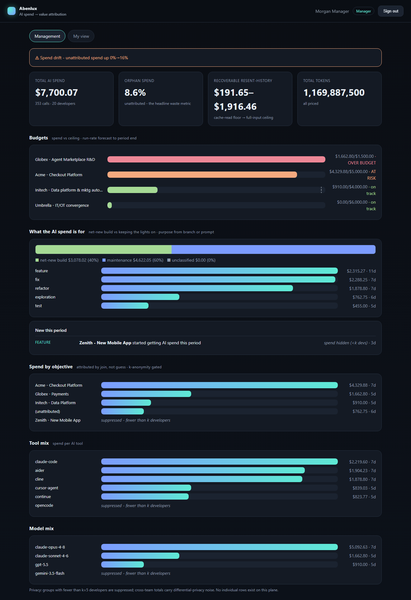
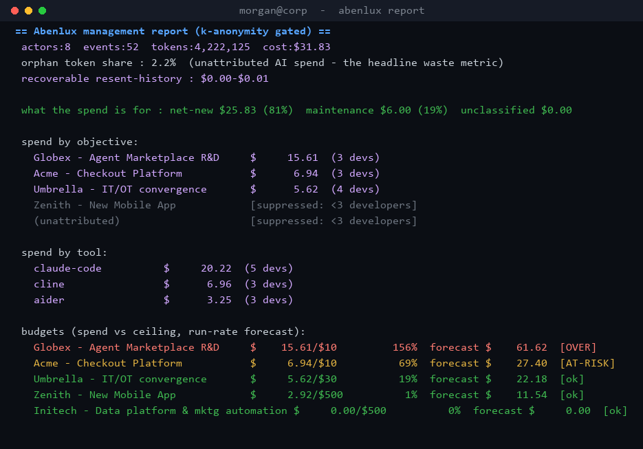
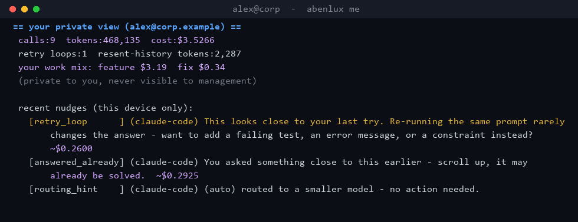
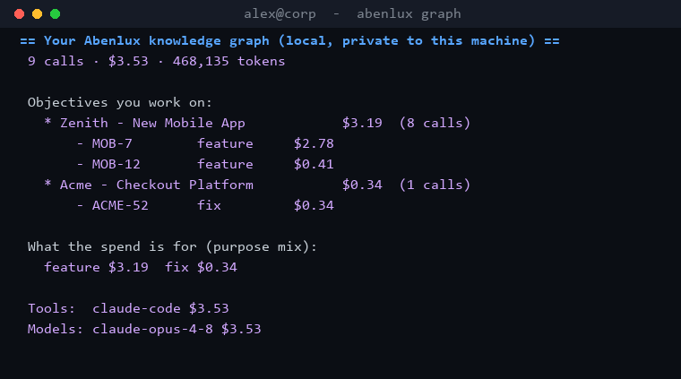
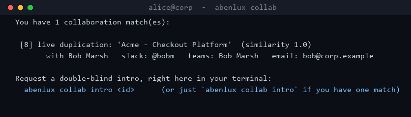
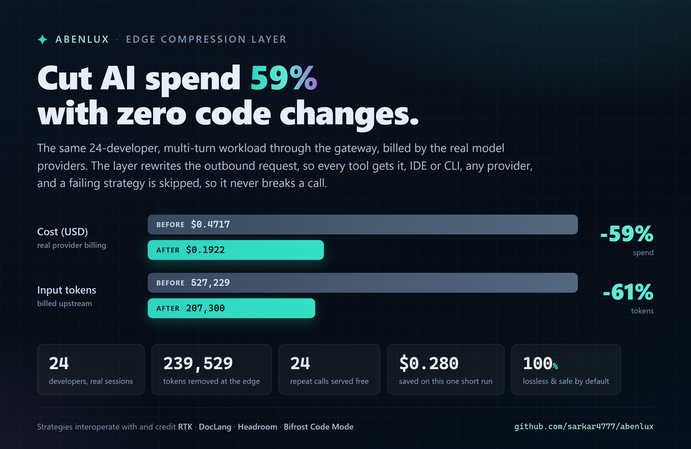
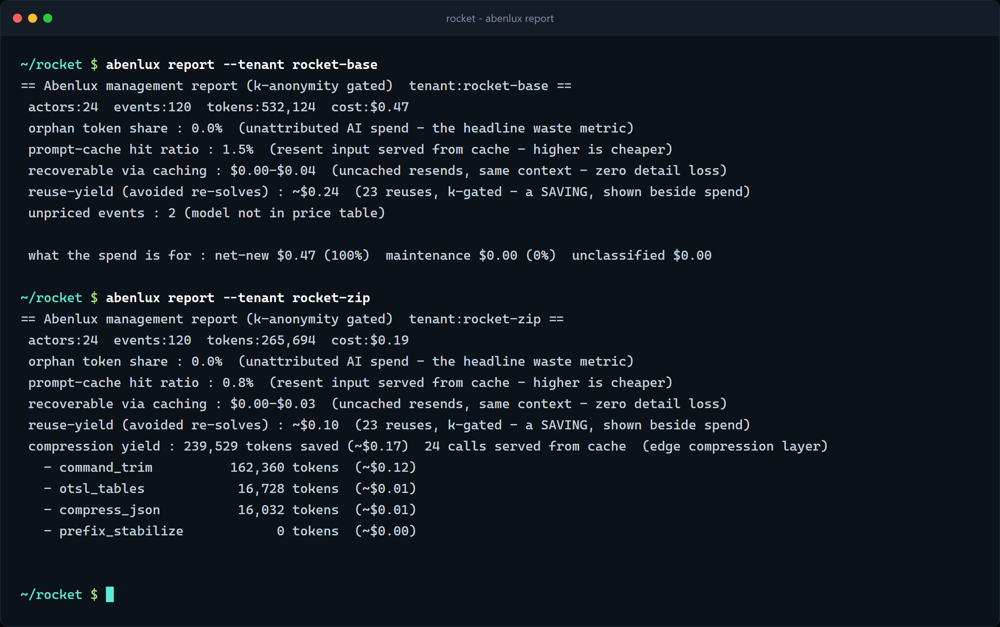
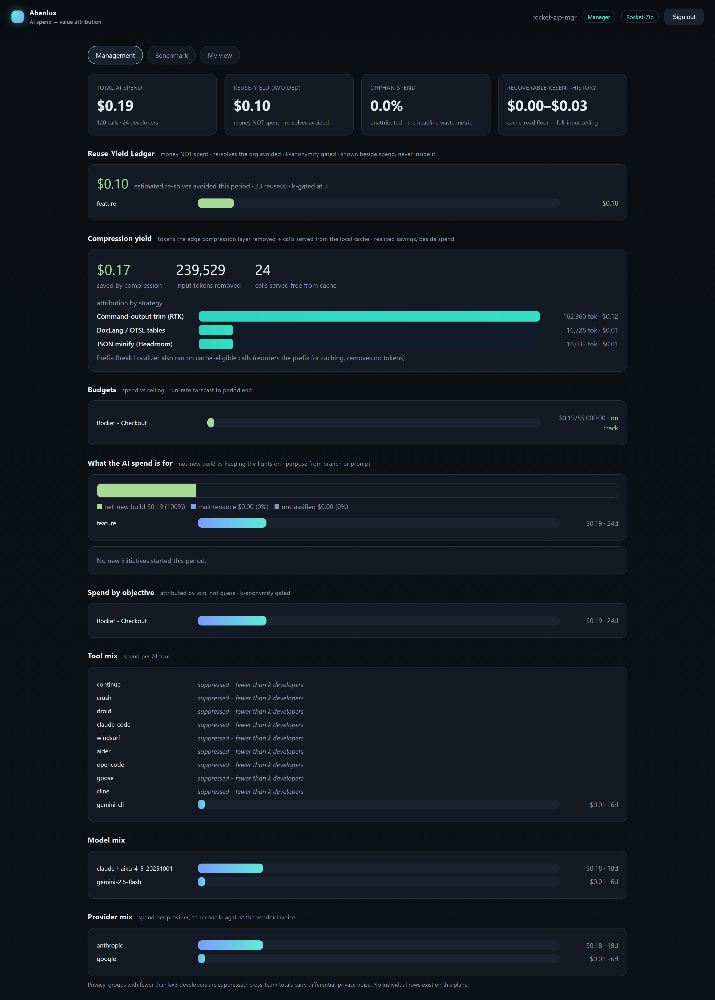

<div align="center">

# ✦ Abenlux

### The AI spend → value attribution plane

**See where every AI token goes, know *what it was for*, tie it to a business objective, catch budget
overruns before they happen, and keep developers private from management — across every IDE and CLI
coding tool. It even learns your team's intent vocabulary so it gets smarter and cheaper over time.**

[](https://github.com/sarkar4777/abenlux/actions/workflows/ci.yml)
[](LICENSE)
[](pyproject.toml)
[](tests/)
[](CRITIQUE.md)

</div>

---

`aben` + *lux* — it puts light on where AI tokens go. Abenlux captures token usage from Claude Code,
Codex, Gemini CLI, Cursor, Copilot, aider, Cline, Continue, opencode, Crush, Droid and more,
normalizes it to one schema, **attributes spend to a business objective by a join (not a guess)**,
classifies **what the spend is for** (new feature vs bug fix vs refactor), prices it in dollars, runs
**objective budgets with forecast and drift alerts**, and **learns your team's intent vocabulary** so
classification gets smarter and nearly free. Every prompt is redacted on the developer's own machine,
and management only ever sees privacy-preserving aggregates.

> **What no other tool does:** objective-tied budget guardrails that warn the **developer** privately
> while management sees only k-anonymized aggregates, with **purpose traceability** (net-new vs
> maintenance) and a **self-learning local knowledge graph** — across **every** coding tool. See
> [CRITIQUE.md](CRITIQUE.md) for the honest competitive analysis and limits.

<div align="center">

<br><em>Real captured data: spend → value, budgets with forecast, what the AI spend is for
(net-new build vs maintenance), new initiatives, orphan spend, drift — all k-anonymized.</em>
</div>

### It is a terminal-first tool. Here is real output, captured from a live multi-user run.

> Everything below was produced by an actual run: a mock upstream, a central collector, and
> gateways forwarding **8 developers across 3 tools and 4 objectives** through the full pipeline.
> No data was seeded. Reproduce it yourself in two terminals from the [Quickstart](#quickstart-60-seconds-no-api-keys).

<div align="center">

<br><em><code>abenlux report</code> — the k-anonymity-gated management view. Spend by objective and tool,
purpose split (net-new vs maintenance), budgets with run-rate forecast (OVER / AT-RISK / ok), and
orphan spend. Objectives and tools under k=3 developers are suppressed, not shown.</em>
<br><br>

<br><em><code>abenlux me</code> — a developer's own private view. Their spend, work mix, and the
mechanical-waste nudges (retry loop, resent history, small-model routing). Never visible to management.</em>
<br><br>


<br><em><code>abenlux graph</code> (left) is the developer's on-device knowledge graph of objectives,
tickets, and purpose. <code>abenlux collab</code> (right) is a real double-blind match after a mutual
intro: the peer's chosen contact handles are revealed only once both sides opt in.</em>
</div>

---

## What sets it apart

| | |
|---|---|
| 🎯 **Spend → value by join** | Branch/ticket → objective via your knowledge graph. No ML, fully auditable. Repo-join and a confidence-gated semantic fallback follow. Unmatched spend is **orphan spend**, the headline waste metric. |
| ♻️ **Cache-aware savings** | Separates fresh input from cache reads/writes per call, reports a **prompt-cache hit ratio**, and flags resent context that *isn't* being cached — the one token-saving lever with **zero loss of detail**, because the exact same context is sent, just billed as a cache hit. |
| 🗜 **Compression layer** | A pluggable set of token savers that run on the **outbound request at the gateway**, so **every tool gets it** (IDE or CLI, any provider) with no setup. Safe lossless strategies run automatically (the **Prefix-Break Localizer** moves an injected date/id out of the cache-stable prefix so prompt caching hits); content-rewriting ones (RTK-style command-output trimming, DocLang/OTSL tables, Headroom-style JSON minify, Bifrost-style tool-def dedupe) are **one flag** (`ABEN_COMPRESS`). An **exact-match cache** serves a byte-identical repeat for free. A failing strategy is skipped, so it **never breaks a call**, and the realized savings show up beside spend. |
| 🧭 **Purpose traceability** | Every dollar is labelled with *what it's for* — feature, fix, refactor, perf, exploration, chore, docs, test — and split into **net-new build vs maintenance**, traced to the ticket. Long, code-heavy, multi-part prompts are reduced to their **salient intent** first, so a pasted stack trace doesn't get mislabelled a "fix". 98.6% accuracy on a 69-prompt corpus, 100% on the net-new/maintenance split. |
| 🆕 **New-initiative radar** | Detects new apps/features that started consuming AI spend this period, with the work type and trace. |
| 🧠 **Self-learning** | Every confident label (branch ground-truth or the LLM) teaches a free keyword layer, so the system classifies more for free and the LLM fires less over time. No signal is wasted. |
| 🕸 **Developer-local knowledge graph** | Each developer owns a private, on-device graph of their objectives, tickets, purpose mix, tools, and self-learned vocabulary. View it anytime with `abenlux graph`. |
| 💸 **Budgets + forecast + guardrails** | Per-objective ceilings, run-rate projection, projected overrun, and a **private** nudge to the developer when their objective is over/at-risk. |
| 📈 **Drift** | Window-over-window orphan-share and cost trend with alerts — the early warning before the quarterly bill. |
| 🤝 **Double-blind collaboration** | Live-duplication and solved-reuse matches across developers — paired on **keyphrase topic vectors** with an **objective-aware** bar, so two people on the same problem match even when phrased differently, and generic shared vocabulary doesn't. Precision-first (a false pairing is worse than a miss): **100% precision** on the labelled corpus. Chinese-wall + residency enforced, identities revealed only on mutual consent. Never a manager-visible report. |
| ♻️ **Reuse-Yield Ledger** | Most tools only count money *spent*. This one also books money **not** spent. When the broker surfaces an already-solved pattern to someone about to re-solve it, an avoided re-solve is booked — valued at the tenant's **winsorized-mean cost-to-solve** for that work (recomputed live, **k-anonymity gated**, never one developer's figure), shown as a savings line *beside* spend, never inside it. The positive mirror of orphan waste. |
| 🌍 **Cross-tenant Benchmark Exchange** | Tenants are org units / geographies of one org (acme-eu, acme-us, …). Compare them on **ratios only** — cost-per-1k, cache-hit, net-new share, reuse share — with **k-anonymity per tenant**, **differential-privacy** noise, and a **cohort threshold** so no tenant reads another off a too-small cohort. You get a **percentile** within the cohort, never another tenant's raw figure. "Is our US region reusing as much as EU?" answered without either side seeing the other's numbers. |
| 🔔 **Ambient developer signals** | Waste/collab/budget nudges via native desktop toast, `abenlux watch`, and `abenlux me` — wherever the developer is, no browser. A **background agent** (`abenlux agent install`) starts at login on Linux/macOS/Windows and runs in your own session, so collaboration matches and budget warnings reach you live, even at org scale. |
| 🔐 **Governance as code** | Edge redaction, derived-only persistence, HMAC pseudonyms, k-anonymity, DP noise, and RBAC where **no role — not even admin — can see another individual's rows**. |
| 🪶 **Minimal, optional LLM** | When branch + patterns + learned vocabulary all miss, one tiny cached call (OpenAI / Azure / Claude / Gemini) with **extractive prompt compression** classifies intent for fractions of a cent. |

---

## Quickstart (60 seconds, no API keys)

```bash
git clone https://github.com/sarkar4777/abenlux
cd abenlux
make install          # pip install -e ".[dev]"
make demo             # one exchange through the full edge pipeline, offline
make test             # 293 tests
```

`make demo` redacts a secret, reassembles a streamed response, prices it, attributes it to an
objective, classifies its purpose, pseudonymizes the actor, and prints the only thing that would ever
persist: a content-free `DerivedRecord`.

Verify any real tool without spending tokens:

```bash
abenlux mock                                   # protocol-correct fake upstream (terminal A)
ABEN_ANTHROPIC_UPSTREAM=http://127.0.0.1:9111 abenlux gateway   # terminal B
ANTHROPIC_BASE_URL=http://127.0.0.1:8088 <your tool>            # terminal C
abenlux me            # your call shows up, privately
abenlux graph         # your personal on-device knowledge graph
```

---

## Run it locally (the two halves, step by step)

Abenlux is **two programs**. You run each in its own terminal. They never share memory; the developer
side redacts on the machine and sends only content-free numbers to the management side over HTTP.

| | Program | Command | Who uses it |
|---|---|---|---|
| **Developer side** | the edge agent (capture) | `abenlux gateway` | a developer, on their laptop |
| **Management side** | the collector + dashboard | `abenlux serve` | IT / finance / managers |

**Step 0 - get the code:**

```bash
git clone https://github.com/sarkar4777/abenlux
cd abenlux
make install          # installs the `abenlux` command (pip install -e ".[dev]")
```

**Easiest: one command boots everything.**

```bash
make dev
```

That starts all three pieces wired together on your machine (a fake model upstream, the management
server + dashboard on `:8090`, and the developer edge agent on `:8088`), prints the URLs and the demo
sign-in tokens, and stays up until you press Ctrl-C. Point any AI tool at `http://127.0.0.1:8088`, open
`http://127.0.0.1:8090` for the dashboard, and run `abenlux me` for the developer view. Nothing to
configure, no API key, no tokens spent. The rest of this section shows what `make dev` does by hand.

**Run the pieces by hand (one terminal, all on your machine, no server):**

```bash
abenlux mock                                                    # a fake model, so no API key/spend
ABEN_ANTHROPIC_UPSTREAM=http://127.0.0.1:9111 abenlux gateway   # the developer side (new terminal)
ANTHROPIC_BASE_URL=http://127.0.0.1:8088 <your tool>            # point any AI tool at it (new terminal)
abenlux me                                                      # see YOUR call, private to you
abenlux report                                                  # see the management view (reads the local file)
```

That is "solo mode": no server, everything in a local file. Good for hacking on the code.

**The full picture (developer side talks to a separate management server):** open two terminals. The
only thing connecting them is a shared secret key and a device token (copy the same values into both).

```bash
# TERMINAL 1 - the MANAGEMENT side (server + dashboard) on port 8090
ABEN_HMAC_KEY=shared-secret ABEN_INGEST_TOKEN=device-token \
ABEN_DB=central.db ABEN_KG=examples/knowledge_graph.example.yaml \
ABEN_PRINCIPALS=examples/principals.example.yaml \
abenlux serve --port 8090
# now open http://127.0.0.1:8090 in a browser and sign in with: mgr-token, fin-token, or admin-token

# TERMINAL 2 - the DEVELOPER side (edge agent), pointed at the server above
ABEN_HMAC_KEY=shared-secret ABEN_INGEST_TOKEN=device-token \
ABEN_COLLECTOR_URL=http://127.0.0.1:8090 ABEN_TENANT=acme-eu ABEN_TOKEN=dev-token \
ABEN_ANTHROPIC_UPSTREAM=http://127.0.0.1:9111 abenlux gateway --port 8088
# then drive a tool at it like above, and run `abenlux me` for the developer's own view
```

The example config (`examples/principals.example.yaml`, `examples/knowledge_graph.example.yaml`) ships
the demo tokens (`dev-token`, `mgr-token`, `fin-token`, `admin-token`) and a few objectives, so you do
not have to write any config to try it.

## Want to change the code?

```bash
make dev      # boot the live stack (mock + server + edge) and poke at your change
make test     # run all tests (fast)
make lint     # style check (ruff)
make demo     # run the whole pipeline once, offline, to see what a change does
```

- The code is under [`src/abenlux/`](src/abenlux/). The pure logic (no web/ML) is in `schema`,
  `pipeline`, `processing`, `attribution`, `analytics`, `privacy`, `pricing` and is the easiest place
  to start; the network parts are `capture/` (edge) and `api/` (server).
- Make a change, add a test next to it in [`tests/`](tests/), run `make test` and `make lint`.
- Two full end-to-end examples you can run with Docker: [`examples/deep-e2e`](examples/deep-e2e/) (one
  container, the whole stack) and [`examples/multi-dev-e2e`](examples/multi-dev-e2e/) (separate
  containers per tenant, runs against a real model if you give it a key).
- See [ARCHITECTURE.md](ARCHITECTURE.md) for how it fits together and [CONTRIBUTING.md](CONTRIBUTING.md)
  for the rules (the privacy invariants must stay green).

---

## Stop solving the same problem twice — double-blind collaboration

Across a big team, people burn tokens re-solving what a colleague already cracked. The naive fix — a
"these two duplicate work" report on a manager's desk — is an efficiency-policing weapon. So Abenlux
does it **peer-to-peer and double-blind**, and it works **without leaving your terminal**.

Matching runs **centrally at the collector** over content-free signals (the embedding + objective,
never prompt text), so two developers on two machines actually match. Two walls are enforced in code:
it never matches across a different **client** (Chinese wall) or a **data-residency** boundary. When
there's a hit, *you* get a private nudge — never your manager:

```bash
$ abenlux collab
  [2] live duplication: 'Acme - Checkout Platform'  (similarity 0.91)
        with a colleague (hidden until you both request an intro)

$ abenlux collab intro 2        # request a double-blind intro, from the terminal
  Intro requested. You are revealed to each other only when they also accept.
```

**Identities and contact handles are exchanged only on mutual consent.** Each developer sets the
handles they're willing to share, and they're revealed to a peer *only* after both opt in:

```bash
$ abenlux contact set --slack @you --teams "Your Name" --email you@corp
$ abenlux collab                # after the other dev also accepts:
  [2] live duplication: 'Acme - Checkout Platform'
        with Finn Finance   slack: @finn   teams: Finn Finance   email: finn@corp
```

Now you can reach out on Slack/Teams/DM and compare notes. It's also a card in the dashboard's *My
view* with a **Request intro** button — same double-blind contract. Two modes: **live duplication**
(you're both on it right now) and **solved reuse** (the org already cracked it — here's who to ask).

### Scaling collaboration to 20,000–30,000 developers

The bundled broker is a brute-force in-memory matcher (one latest embedding per developer, O(n) scan)
— perfect for a pilot of hundreds to low thousands. For tens of thousands of developers, swap the
matcher for a **vector index** without changing the interface (`submit(signal) → matches`):

- Keep **one latest embedding per developer** (the broker already does this), partitioned by
  **(client, residency)** so the Chinese wall is a partition boundary, not a scan filter.
- Back it with **pgvector / Qdrant / Milvus / hnswlib** and make a match an **ANN top-k query**
  above the similarity threshold within the partition — O(log n) instead of O(n), and stateless, so
  the collector scales horizontally. At 30k devs that's ~30k vectors per partition, trivially indexed.
- Embeddings are content-free vectors, so this stays within the privacy model. The match/consent/
  contact layer (`developer/matches.py`, `developer/contacts.py`) is unchanged.

That seam is intentional: the in-memory broker and a vector-DB broker are interchangeable behind the
same `CollaborationBroker.submit` contract.

---

## 👩‍💻 For developers: download and configure (separate from the management UI)

A developer installs **one** thing — the edge agent — and never needs the dashboard. It runs locally,
redacts on the device, and (in an org) forwards only content-free records to the collector.

```bash
pipx install abenlux            # or: pip install abenlux

# in an organization, point the edge agent at your collector (values from IT):
export ABEN_COLLECTOR_URL=https://abenlux.mycorp.internal
export ABEN_INGEST_TOKEN=<device token>
export ABEN_HMAC_KEY=<org pseudonymization key>

abenlux gateway                 # loopback capture agent on :8088
abenlux onboard <tool>          # prints the exact env/config for YOUR tool + shell
```

Then point your tool at the agent. **`abenlux onboard <tool> --shell <bash|powershell|cmd>` prints the
exact copy-paste setup for your tool and OS.** Concretely:

| Your tool | Exactly what to do (agent runs on `http://127.0.0.1:8088`) |
|---|---|
| **Claude Code** | `CLAUDE_CODE_ENABLE_TELEMETRY=1 OTEL_LOGS_EXPORTER=otlp OTEL_METRICS_EXPORTER=otlp OTEL_EXPORTER_OTLP_PROTOCOL=http/json OTEL_EXPORTER_OTLP_ENDPOINT=http://127.0.0.1:8088 claude` (the per-call token + cache usage rides on the **logs** signal, so `OTEL_LOGS_EXPORTER=otlp` is required) |
| **OpenAI Codex** | Codex speaks the OpenAI **Responses API**. In `~/.codex/config.toml` add a provider with `base_url = "http://127.0.0.1:8088/v1"` and `wire_api = "responses"`, set `model_provider` to it, then run `codex exec "..."`. The gateway captures `/v1/responses`. |
| **Gemini CLI** | set `~/.gemini/settings.json` to `{"security":{"auth":{"selectedType":"gemini-api-key"}}}` (so the base-URL override doesn't flip it to gateway-auth), then `GEMINI_API_KEY=<key> GOOGLE_GEMINI_BASE_URL=http://127.0.0.1:8088 gemini -p "..."` |
| **aider** | `ANTHROPIC_BASE_URL=http://127.0.0.1:8088 aider`  (OpenAI models: `OPENAI_BASE_URL=http://127.0.0.1:8088/v1`; Azure: point `AZURE_API_BASE` at the gateway) |
| **opencode** | add a provider in `opencode.json` with `options.baseURL = "http://127.0.0.1:8088/v1"`, then `opencode run -m <provider>/<model> "..."` |
| **Crush · Droid · ForgeCode · Goose** | export `ANTHROPIC_BASE_URL=http://127.0.0.1:8088` (or `OPENAI_BASE_URL=http://127.0.0.1:8088/v1`), then run the tool |
| **Azure OpenAI** (any tool) | start the agent with your Azure host as upstream: `ABEN_AZURE_UPSTREAM=https://YOUR-RESOURCE.openai.azure.com abenlux gateway`, then set the tool's `azure_endpoint` to `http://127.0.0.1:8088`. The agent forwards your `api-key` header and `api-version` query untouched. |
| **Cline · Roo · Kilo** (VS Code) | in the extension's provider settings, set **Base URL** to `http://127.0.0.1:8088` |
| **Continue** (VS Code) | in `~/.continue/config.json`, set the model's `apiBase` to `http://127.0.0.1:8088/v1` |
| **Cursor agent · Copilot inline** | nothing on the device — these assemble the prompt server-side, so IT pulls usage via the vendor admin API (`abenlux sync-cursor`) |

Confirm it's working: run a prompt in your tool, then `abenlux me` — your call appears, privately.

> **Verified end-to-end with the real tools, not mocks of them.** Capture and per-call cost were
> checked by driving the genuine **Claude Code** (Tier-1 OTel, real session telemetry incl. cache
> tokens), **Gemini CLI**, **OpenAI Codex** (Responses API), **aider** (against a real Azure gpt-4o,
> where abenlux's captured cost matched aider's own report), and **opencode** through a running
> gateway, plus the real Anthropic / OpenAI / Azure SDKs. Two real bugs were found and fixed this way:
> Gemini's URL-based streaming flag (capture was being dropped) and its model living in the URL (it
> priced to $0). Claude Code's usage rides on `claude_code.api_request` **log** events with bare
> `input_tokens`/`cache_read_tokens` attributes — not the `gen_ai.*` semconv — so it needed its own
> parser, and its raw `user.email` is dropped at the edge. Reproduce the Gemini/Codex/opencode checks
> yourself with [`examples/tool-verification`](examples/tool-verification/) (one Docker image, one script).

Everything the developer sees is **private to them**, never the management plane:

```bash
abenlux me        # your spend + waste/collab nudges
abenlux watch     # live ambient tail in a spare terminal pane
abenlux graph     # your local knowledge graph: objectives, tickets, purpose, learned vocabulary
abenlux collab    # collaboration matches; `collab intro <id>` to request a double-blind intro
abenlux contact   # set the handles colleagues can reach you on after a mutual intro
```

Native desktop toasts fire automatically when a nudge happens. Full per-tool/per-OS guide:
**[DEPLOYMENT.md](DEPLOYMENT.md)**.

**Run it in the background, started at login (no admin):**

```bash
abenlux agent install     # autostarts at login and runs in your session, so toasts actually render
abenlux agent status      # check it
abenlux agent uninstall   # remove it
```

`agent install` snapshots your config to `~/.abenlux/agent.env` and drops the right per-OS unit: a
**systemd `--user`** service (Linux), a **launchd LaunchAgent** (macOS), or a hidden **Startup-folder
launcher** (Windows — chosen over a scheduled task so it works for a standard, non-admin user). It runs
as **you**, inside your GUI session, because that's the only place desktop toasts and the D-Bus/Aqua
notification daemons exist. In org/forward mode the agent also polls the collector for *your* new
collaboration matches and live-pushes a toast — matching happens centrally, but the nudge still finds you.

### Make it ultra-smart (optional, almost free)

Point Abenlux at whatever LLM your org already uses to classify intent on the rare prompts that branch
and keyword patterns miss. It uses a cheap model, a 5-token reply, extractive compression of long
prompts, and a cache — fractions of a cent at org scale — and it *teaches the free layer* so it fires
less over time. Standard env names work out of the box:

```bash
# OpenAI / Azure OpenAI / Anthropic / Gemini — pick one
export LLM_PROVIDER=azure
export AZURE_OPENAI_API_BASE=...   AZURE_OPENAI_API_KEY=...   AZURE_OPENAI_DEPLOYMENT_FAST=gpt-4o
```

---

## 🏢 For IT: install the collector + dashboard

```bash
ABEN_HMAC_KEY=<org key> ABEN_DB=<sqlite or postgres dsn> ABEN_KG=knowledge_graph.yaml \
ABEN_PRINCIPALS=principals.yaml ABEN_INGEST_TOKEN=<device token> \
abenlux serve --host 0.0.0.0 --port 8090
```

Open `http://<host>:8090/` and sign in. Managers/finance see the k-anonymized spend→value dashboard
(budgets, purpose, new initiatives, drift, tool/model mix), a **Benchmark** tab comparing their org's
tenants, and a read-only roster of those tenants. Admins additionally get a **Tenants** tab to create
and list org units / geographies. Developers see only their own private view — never tenant
management, never another individual's rows. Tenant RBAC is enforced server-side: **create needs
admin** (`MANAGE`), **list needs manager+** (`VIEW_AGGREGATES`), both scoped to the caller's own org.
Admins manage the knowledge graph. A *central* gateway would see raw prompts before redaction — so
the edge agent redacts on the device and forwards only the content-free `DerivedRecord`.

---

## Save tokens automatically (the compression layer)

<div align="center">

<br><em>Real before/after: the same 24-developer, multi-turn workload through the gateway, billed by
the real model providers. Compression on cut input tokens 61% and cost 59% with no change to any tool.
Reproduce it from <a href="examples/compression-e2e/">examples/compression-e2e</a>.</em>
<br><br>

<br><em>The same result straight off the CLI: <code>abenlux report</code> for the uncompressed tenant
(left) and the compressed one (right). The compression-yield block, attributed by strategy, appears
only on the right, beside spend and reuse-yield.</em>
</div>

Because the edge agent is a loopback proxy, it can shrink the **outbound request** before it is
forwarded. This runs for **every tool, IDE or CLI, any provider**, with no per-tool setup and no
context switching. Two rules keep it safe for developers:

- **Safe-and-lossless strategies run automatically.** Today that is the **Prefix-Break Localizer**: it
  moves an injected `Today is <date>` / request-id out of the cache-stable prefix of your system
  prompt so the provider's prompt cache actually hits. Same content, reordered, ~10x cheaper input.
- **Strategies that rewrite prompt content are one flag.** `ABEN_COMPRESS=command_trim,otsl_tables,compress_json,slim_tools`
  (or `all`) turns them on for every tool at once. A strategy that errors is skipped, so compression
  **can never break your call**. `ABEN_COMPRESS=off` disables everything.

| Strategy | What it does | Lossless | Default |
|---|---|:--:|:--:|
| `prefix_stabilize` | move an injected date/id out of the cache-stable prefix | ✅ | **on** |
| `command_trim` | strip ANSI, collapse repeated lines, truncate huge command output | near | off |
| `otsl_tables` | verbose HTML tables to compact OTSL | ✅ (cells) | off |
| `compress_json` | minify embedded JSON blobs | ✅ | off |
| `slim_tools` | drop duplicate tool/function definitions resent each turn | ✅ | off |
| exact-match cache | serve a byte-identical non-streamed repeat for free (`ABEN_EXACT_CACHE`) | ✅ | **on** |

The realized savings (tokens removed, calls served from cache) show up beside spend in `abenlux report`
and the dashboard, **attributed by strategy** so you see which technique earned which dollar:

<div align="center">

<br><em>The real management dashboard from a 24-developer, 5-turn run: the Compression-yield card shows
tokens removed and calls served free from the cache, broken down by strategy (command-output trim,
DocLang/OTSL, JSON minify), beside spend, reuse-yield and budgets. All k-anonymized.</em>
</div>

These strategies are abenlux's own bounded implementations, built to **interoperate
with and credit** the open tools that pioneered them:

- **[RTK (Rust Token Killer)](https://github.com/rtk-ai/rtk)** (MIT) compresses command output at the
  agent's tool-hook layer, *below* abenlux; the two stack, and `abenlux agent install` wires RTK's hook
  when RTK is present.
- **[DocLang / Docling](https://github.com/docling-project/docling)** (LF AI & Data) is the AI-native
  document format; `otsl_tables` uses its compact OTSL table form.
- **[Headroom](https://andrew.ooo/posts/headroom-context-compression-llm-agents-review/)** pioneered
  JSON/AST context compressors; `compress_json` is a bounded version.
- **Bifrost "Code Mode"** popularized tool-definition slimming for coding agents; `slim_tools` dedupes
  identical definitions.

---

## What this release adds (in plain words)

Eight new things, grouped by what they are for. Spend less. Get smarter about whether the spend was
worth it. Help people help each other. Reach more tools. Reproduce all of it with real models from
[examples/features-e2e](examples/features-e2e/).

### Spend less

- **Cache breakpoints.** A model can read the unchanging top of your prompt from its own memory instead
  of being charged for it again. We mark where that steady part ends so the provider keeps it. It
  changes nothing the model reads, so it is safe and on by default.
- **Tool result trim.** In an agent session the biggest part of every request is the output of the
  tools the agent ran, and the same output is sent again every turn. We fold the noise out of it. The
  instructions and the answer are never touched.
- **Shadow measure.** A few savers are off by default because they change your prompt text. We run them
  quietly in the background without touching your call and show what turning each one on would have
  saved. A manager turns one on with proof, not a guess.

### Know if the spend was worth it

- **Spend to value.** Spend tells you what the AI cost. It does not tell you if the work shipped. A
  small content free feed from git or your build system tells us whether a change merged, whether it was
  reverted, and how many lines it touched. We join that to spend and show the return, like dollars per
  merged change. Nothing here is a guess and nothing here is your code.
- **Orphan recovery.** Orphan spend is AI money that did not tie to any goal, and it is the headline
  waste number. We group the untracked work that is about the same thing, and when enough people share a
  group we propose a name for it. A manager accepts once and that work tracks itself from then on, so
  tomorrow's waste pool is smaller.

### Help people help each other

- **Solution capsules.** When you start on something the team already cracked, you now see a small
  content free card right away. It says which model and tool cracked it and a rough cost band, so you
  pick the right model first. It holds no code and no prompt.
- **Ask without waiting.** You can send the person who solved your problem one question right away,
  before any introduction, and they answer when they are around. Neither side sees who the other is
  until you both agree. Every message is cleaned of secrets before it is stored.

### Reach more tools

- **A tool for your coding agent.** Run `abenlux mcp` and the agent can ask, in the middle of a task,
  am I over budget, has anyone solved this, what is this branch for, and what would this call cost. It
  only ever returns your own data and adds no new permission.
- **Compare across companies, safely.** Every company wants to know how its AI efficiency stacks up
  against its peers, but none will hand over raw numbers. So each company blurs its own numbers on its
  own machine and sends only the blurred version. The exchange waits until enough companies have joined,
  then tells each one only its rank in the group, never another company's number.

---

## Capture is tiered by how each tool actually makes its call

`abenlux tiers` prints the live matrix. We never present metadata-only data as full-content data.

| Tier | How | Tools | Full prompt | Exact tokens |
|---|---|---|:--:|:--:|
| **1 — OTel-native** | tool self-instruments to OTel GenAI | Claude Code, Codex, Gemini CLI, Copilot agent | ✅ opt-in | ✅ |
| **2 — Gateway** | tool honors a custom `base_url` | aider, Cline, Continue, opencode, Crush, Droid, ForgeCode, Roo, Goose, Kilo | ✅ | ✅ |
| **3 — Vendor API** | prompt assembled server-side | Cursor agent, Copilot inline, Windsurf, Amazon Q | ❌ | metadata |

**Tier 3 is a ceiling, not a bug.** Cursor and Copilot build the prompt on their own backend, so the
real prompt never exists on the device. The only legitimate signal is the vendor's admin API.

---

## How the intelligence works

```
purpose of spend  =  branch convention   (free, auditable: feature/ fix/ spike/ ...)
                  →  keyword patterns + the device's self-learned vocabulary   (free)
                  →  one tiny LLM call on an extractively-compressed prompt    (rare, cached, ~5 tokens)
                  ↑
                  every confident label feeds the learner, so the free layers get smarter over time
```

The privacy posture *is* the pipeline order, run **on the device**:

```
capture (full content, in-flight only)
  → REDACT        destroy secrets/PII before anything is written or derived
  → DERIVE        embedding + token facts + cost + waste + purpose  (vectors and labels, not text)
  → ATTRIBUTE     join work-context → objective, semantic fallback, flag orphan
  → PSEUDONYMIZE  one-way HMAC the actor, drop the raw id
  → PERSIST       the DerivedRecord only, raw content is discarded here
  → FORWARD       ship the content-free DerivedRecord to the central collector
```

There is no central, management-readable store of anyone's prompts. That asset never exists. Details:
**[ARCHITECTURE.md](ARCHITECTURE.md)**.

---

## Built for thousands of developers

- **Storage:** SQLite (WAL) by default, **optional Postgres** (`pip install abenlux[postgres]`, point
  `ABEN_DB` at a `postgresql://` DSN). Schema self-migrates on open.
- **Forwarding:** the edge batches + spools derived records, retries on collector outage, dedups by
  event id — at-least-once delivery, and a collector blip never breaks a developer's call.
- **Privacy at scale:** k-anonymity (k≥5) suppression, DP noise on org totals, per-device ingest
  tokens, RBAC enforced server-side.
- **Cross-platform:** Windows, macOS, Linux. CI runs the suite on all three across Python 3.10-3.13.

---

## Command reference

```
abenlux demo / gateway / serve / mock      run the pipeline / edge agent / collector / fake upstream
abenlux agent install / status / uninstall background capture agent, autostarted at login
abenlux onboard <tool>                     exact setup for a tool on your OS/shell
abenlux tiers                              the tool capability matrix
abenlux cost <model>                       price an interaction
abenlux report [--tenant <id>]             management spend→value report (k-anonymity gated)
abenlux tenant create <id> --org <org>     create an org unit / geography (tenant); `tenant list`
abenlux benchmark [--tenant <id>]          compare your tenant vs the org cohort (k-anon, DP)
abenlux me [--today] / watch               your own private spend (--today: burn-rate) / live tail
abenlux calls [--top-cost] [--today]       your own recent calls, per-call (private to you)
abenlux graph [--json]                     your developer-local knowledge graph
abenlux collab [intro <id>]                see / act on double-blind collaboration matches
abenlux contact [set --slack ...]          your shareable contact card (revealed only on mutual intro)
abenlux detect / sync-cursor               detected tool / pull Tier-3 Cursor usage (metadata only)
```

---

## Testing

293 unit + integration tests, including an **exhaustive multi-user org simulation**, the **real
Anthropic, OpenAI, and Azure OpenAI SDKs driven through a live gateway**, wire-format tests pinned
from genuine **Claude Code, Gemini CLI, and Codex (Responses API)** traffic, a self-learning loop
test, a **multi-tenant + Reuse-Yield Ledger + Benchmark Exchange** suite (tenant scoping, k-anon
savings, DP-noised cross-tenant percentiles, and the org/residency walls), and a Playwright browser
test of every dashboard screen and role. The supported CLI tools were additionally exercised
end-to-end against a running gateway (see the verification note above).

Two labelled accuracy corpora keep the parts management and developers rely on honest:

- **Intent (work-type)** — 69 prompts spanning terse, verbose, polite, symptom-style, multi-part, and
  code/stack-trace-laden phrasings: **98.6%** label accuracy and **100%** on the net-new-vs-maintenance
  split management reports ([tests/test_intent_corpus.py](tests/test_intent_corpus.py)).
- **Collaboration** — labelled task groups across objectives: **100% precision** (it never pairs two
  people who aren't actually on the same problem) at **100% recall** on the corpus
  ([tests/test_collab_corpus.py](tests/test_collab_corpus.py)).

```bash
make test       # 293 tests
make lint       # ruff (incl. no-semicolon style)
```

## Docs

- **[DEPLOYMENT.md](DEPLOYMENT.md)** — developer install vs IT install, every tool, every OS
- **[ARCHITECTURE.md](ARCHITECTURE.md)** — module map, data flow, the five invariants
- **[CRITIQUE.md](CRITIQUE.md)** — what no tool does, competitive comparison, honest gaps
- **[CONTRIBUTING.md](CONTRIBUTING.md)** · **[SECURITY.md](SECURITY.md)** · **[CHANGELOG.md](CHANGELOG.md)**

## License

MIT. See [LICENSE](LICENSE).
